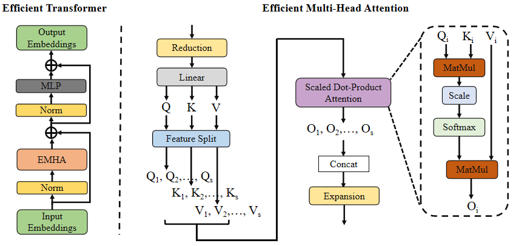

# ESRT
Efficient Transformer for Single Image
Super-Resolution

## Update
#######22.03.17########

The result images of our method are collected in fold "/result".

## Development Environment Setup

1. Install pyenv to manage the Python version: <https://github.com/pyenv/pyenv>

   ```bash
   pyenv install 3.10.8
   pyenv local 3.10.8
   ```

1. Create new virtual environment

    ```bash
    python -m venv .venv
    source .venv/bin/activate
    ```


## Environment
* pytorch >=1.0
* python 3.6
* numpy
```
pip install -r requirements.txt

```


## Model
<p align="center">
     <br />
    <em> The overall architecture of the proposed Efficient SR Transformer (ESRT). </em>
</p>
<p align="center">
     <br />
    <em> Efficient Transformer and Efficient Multi-Head Attention. </em>
</p>

## Train
* dataset: DIV2K
* prepare

  Like [IMDN](https://github.com/Zheng222/IMDN), convert png files in  DIV2K to npy files:
  ```python
  python scripts/png2npy.py --pathFrom /path/to/DIV2K/ --pathTo /path/to/DIV2K_decoded/
  python scripts/png2npy.py --pathFrom "dataset/DIV2K_train_LR_bicubic/" --pathTo "dataset/DF2K_decoded_v2/"
  
  
  ```
* Training
```shell
python train.py --scale 2 --patch_size 96
python train.py --scale 3 --patch_size 144
python train.py --scale 4 --patch_size 192

python train.py --scale 2 --patch_size 96 --root 'dataset/' --threads 0

```
If you want a better result, use 128/192/256 patch_size for each scale.

## Test
Example:

* test B100 X4
```shell
python test.py --is_y --test_hr_folder dataset/benchmark/B100/HR/ --test_lr_folder dataset/benchmark/B100/LR_bicubic/X4/ --output_folder results/B100/x4 --checkpoint experiment/checkpoint/x4/epoch_990.pth --upscale_factor 4
```

## Visual comparison
<p align="center">
     <br />
    <em> The visual comparison. </em>
</p>
